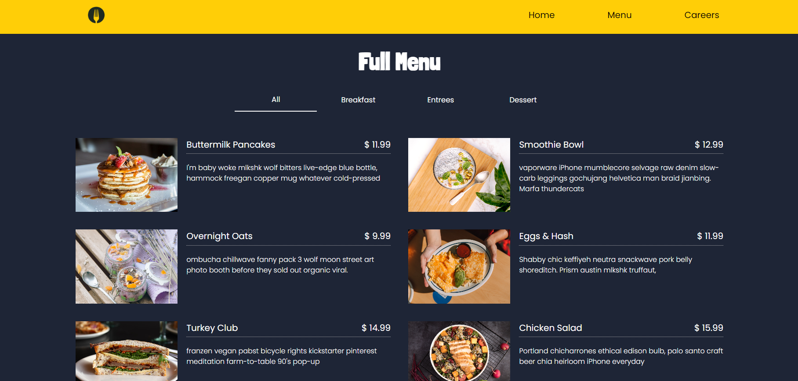
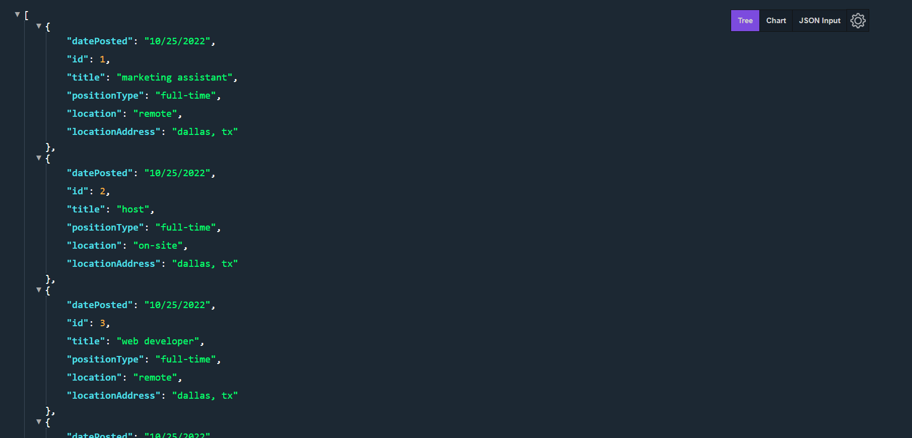

# The Sunday Bite
- Full-stack application built using Vue.js, Node.js and MySQL.

## Description
- Mock restaurant website with a dynamic menu and careers page.
- Menu and careers data fetched from [API built using Node & MYSQL](https://github.com/nvsco-10/sunday-bite-db) (separate repo & deployment).
- Front-end deployed via Netlify, Back-end deployed via Heroku.

  

## Technologies Used
Front-end:
* vue
* vue-router
* json-server (during development)

Back-end:
* Node
* MYSQL2
* Sequelize
* express
* express-async-errors
* cors
* dotenv

## APIs
Menu
- https://the-sunday-bite-api.herokuapp.com/api/v1/menu

Careers Open Positions
- https://the-sunday-bite-api.herokuapp.com/api/v1/careers/positions

  

## Future Developments
- Admin dashboard to manage menu and careers data.
- Authentication to access admin dashboard

